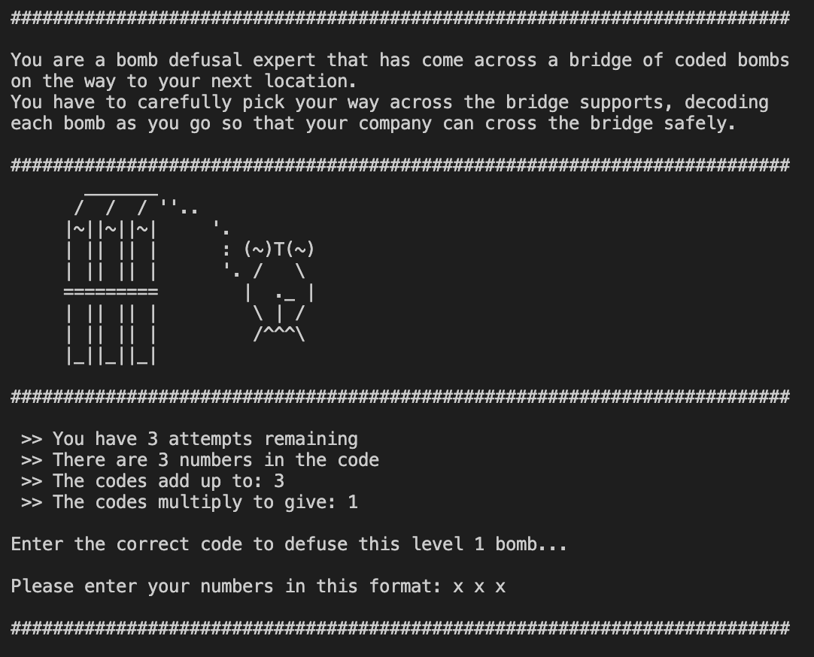
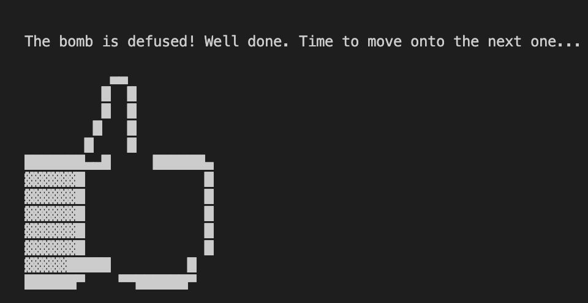
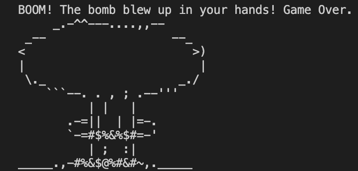

# TRIPLE X

## Code Breaking Game Written in C++

### Laura Ashcroft

<table>
<td></td>
<td></td>
<td></td>
</table>

###

A short, fun game using logic and maths to complete the levels!

You are a bomb defusal expert that has come across a bridge of coded bombs on the way to your next location.
You have to carefully pick your way across the bridge supports, decoding each bomb as you go so that your company can cross the bridge safely.

## How to use

1. Read the introduction to set the scene of the game.
2. You need to defuse bombs by entering the correct 3 letter code.
3. The 3 letter combination will have both a sum they add up to, and a product they multiply to.
4. You have 3 lives throughout the game to make the correct guesses or the bomb will blow up!
5. Complete level 5 to beat the game and save the bridge!

## Installation

1. Clone or download this repository.
2. Compile the file by entering 'g++ TripleX.cpp' into the terminal
3. Execute the file by entering './a.out' into the terminal
4. The game will start!
